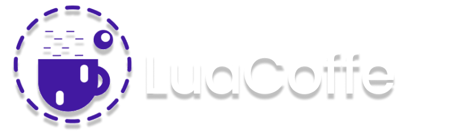
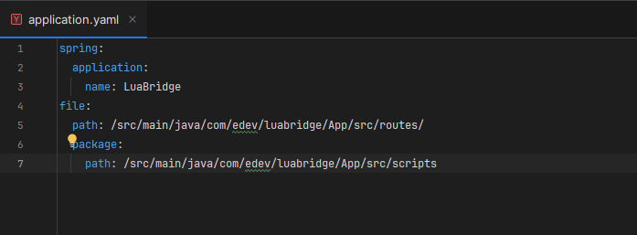

<h1>OppoSys - LuaCoffe</h1>

LuaCoffe is a framework developed by OppoSys, created in JAVA that aims to enable the fast and efficient creation of Lua applications.

<h2>How does it work?</h2>

LuaCoffe is a platform that integrates the simplicity and flexibility of the Lua language with the robustness and performance of Java. It uses the LuaJ interpretation API, which allows Lua scripts to be processed on the JVM (Java Virtual Machine), creating a hybrid environment where both worlds coexist efficiently.

 
<h2>LuaCoffe Architecture</h2>

At the heart of LuaCoffe is LuaJ and SpringBoot. LuaJ enables the execution of Lua scripts within a Java server created with Tomcat through SpringBoot. The server developed with SpringBoot provides the necessary infrastructure for creating endpoints and managing HTTP calls.

 
<h2>How LuaCoffe Works</h2>

The architecture of LuaCoffe allows you to create a Java server (based on Spring Boot) and, within this server, execute Lua scripts through integration with LuaJ. The process unfolds as follows:

<ol>
<li><b>Execution of Lua Scripts:</b>
LuaCoffe uses LuaJ, a library that implements Lua code execution within the JVM. This means Lua scripts can be sent and executed within the Java server, returning results either synchronously or asynchronously, depending on the need.
</li>
<li><b>API Creation with Spring Boot: </b>
The server is structured with Spring Boot, which manages the creation of RESTful APIs. LuaCoffe simplifies the creation of endpoints on the Java server to expose functionalities, such as GET, POST, and others, and allows these endpoints to execute functions defined in Lua scripts.
</li>
<li><b>Integration of Java Modules with Lua: </b>
The integration between Lua and Java in LuaCoffe is made through the require() function, which allows the use of Java libraries directly in Lua scripts. This enables developers to write simple Lua code while having access to the full power of Java libraries and frameworks.
</li>
<li><b>Facilitating Integration of Java Libraries for Lua</b>
Java libraries in LuaCoffe can also be added through the L.C (LuaCoffe) libs table, which allows Java libraries to be used directly in Lua scripts. You can do this through the quick access method <code>luaCoffe.libs</code>
</li>
</ol>
 
<h2>LuaCoffe Setup</h2>

Once you clone the LuaCoffe repository, you can start development right away, or configure the development paths in your <code>application.yaml</code>.

<h3>Modifying the Paths</h3>

To modify the development paths in L.C, access the LuaCoffe configuration file at <code>src/main/resources/application.yaml</code>. This file is responsible for the configuration of the SpringBoot application. Learn more at: <a href="https://www.baeldung.com/spring-boot-yaml-vs-properties">Using application.yml vs application.properties in Spring Boot</a>.
When you access the folder, you will see something like this:
 

 

To change the development folders, you just need to modify the path in 
<pre>
<code>
file: 
    path: {development path}

// Inside file, we also have the attribute 

    package:
        path: {path for scripts to be imported}
</code>
</pre>
where you can also modify the path for scripts that will be used as support for your endpoints.
These attributes are responsible for specifying where, in your <code>.../App/..</code> folder, there will be a scan for the given endpoint.

 
<h2>Creating Endpoints</h2>

Creating endpoints in LuaCoffe is extremely simplified; all you need to do is add the mapping tag above your script. However, keep in mind that your script must be inside the path specified in your <code>application.yaml</code>.
 
<pre>
<code>
file: 
    path: {development path}
    package:
        path: {path for scripts to be imported}
</code>
</pre>
 
Then you can add the tag <code>luaCoffe.mapping("**method**/any/route/**nameOfYourFile**")</code>
 
Ex: <b>HelloWorld.lua</b>
<pre>
<code>
    luaCoffe.mapping(get/my/route/HelloWord)
    return {code = 200, response = "Hello, World!"}
</code>
</pre>
 
It is important to note that without the tag specifying the route for calling your file, it will be closed for calls and cannot be used as an endpoint.

<h2>Working with Multiple Scripts <code>import()</code></h2>

When developing web applications, we often face the need to reuse code. The <code>import()</code> in LuaCoffe makes this task easier by allowing multiple Lua scripts to be used together, promoting modularity and reuse of functions and logic across different parts of the application.

With LuaCoffe, you can import any script within the path configured in <code>application.yaml</code>. This allows one script to access functions and variables from another, keeping the code organized and modular. Instead of repeating code, you simply import it where needed.

<h3>Example of Script Import</h3>

Suppose you have a script <b>mathUtils.lua</b> with mathematical functions that you want to reuse in various parts of the application:

<pre><code>-- mathUtils.lua
MathUtils = {}
MathUtils.__index = MathUtils
function MathUtils:add(a, b)
    return a + b
end

function MathUtils:multiply(a, b)
    return a * b
end
return MathUtils
</code></pre>

Now, in another Lua script, you can import <code>mathUtils.lua</code> and use its functions:

<pre><code>-- main.lua
local mathUtils_import = import("mathUtils")
local mathUtils_Class = mathUtils_import();
local mathUtils_Instance = setmetatable({}, mathUtils_Class)

local sumResult = mathUtils:add(10, 20)
local multiplyResult = mathUtils:multiply(5, 4)

return {
    code = 200,
    response = "Result: " .. sumResult .. " and " .. multiplyResult
}
</code></pre>

With this, you can easily split the application logic into different files and reuse these functions across various endpoints, keeping the code cleaner and more modular.

<h2>Facilitating Integration of External Libraries</h2>

LuaCoffe also allows the integration of external libraries both in Lua and in Java. For Lua, the libraries just need to be in the correct directory as specified in <code>application.yaml</code>, and you can import them directly into your scripts. For Java libraries, the framework provides an easy access mechanism through the <code>luaCoffe.libs</code> function, allowing Java functionalities to be exposed and used directly in Lua scripts.

<h3>Example of Integration with Java Libraries</h3>

Suppose you want to use the <code>OkHttp</code> library to make HTTP requests from a Lua script. On the Java side, the library must already be configured in the classpath, and then you can use it as follows in LuaCoffe:

<pre><code>-- httpClient.lua

function makeRequest(url)
    local req = luaCoffe.lib.luaOkHttp.get(url)
    local response = req
    -- Returns a lua table with the Json values
    return luaCoffe.libs.luaJson.jsonToLua(req)
end
</code></pre>

This example shows how it is possible to use the power of Java libraries directly in Lua scripts, enhancing development potential while maintaining Lua's simplicity in the application logic layer.

<h1>LuaJ API</h1>
