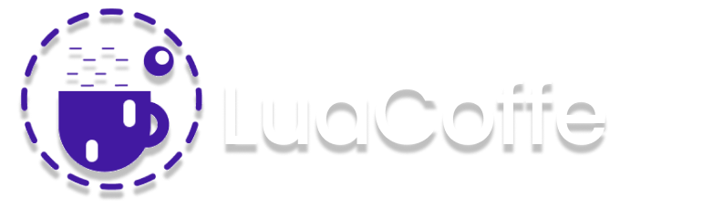

<h1>OppoSys - LuaCoffe</h1>

LuaCoffe é um framework em JAVA que visa permitir a criação de aplicações Lua de forma rápida e eficiente.

<h2>Como funciona?</h2>

O LuaCoffe é uma plataforma que integra a simplicidade e flexibilidade da linguagem Lua com a robustez e performance do Java. Ele usa a API de interpretação LuaJ, que permite que scripts Lua sejam processados na JVM (Java Virtual Machine), criando um ambiente híbrido onde ambos os mundos coexistem de forma eficiente.

 
<h2>Arquitetura do LuaCoffe</h2>

No coração do LuaCoffe está o o LuaJ e o SpringBoot, LuaJ possibilita a execução de script Lua dentro de um servidor Java criado com Tomcat através do SpringBoot. O servidor desenvolvido com SpringBoot fornece a infraestrutura necessária para a criação de Endpoints e gerênciamento de chamadas HTTP.

 
<h2>Funcionamento do LuaCoffe</h2>

A arquitetura do LuaCoffe permite que você crie um servidor Java (baseado no Spring Boot) e, dentro desse servidor, execute scripts Lua através da integração com o LuaJ. O processo se desenrola da seguinte forma:

<ol>
<li><b>Execução de Scripts Lua:</b>
O LuaCoffe utiliza o LuaJ, uma biblioteca que implementa a execução de código Lua dentro da JVM. Isso significa que os scripts Lua podem ser enviados e executados dentro do servidor Java, retornando os resultados de forma síncrona ou assíncrona, conforme a necessidade.
</li>
<li><b>Criação de APIs com Spring Boot: </b>
O servidor é estruturado com Spring Boot, que gerencia toda a parte de criação de APIs RESTful. O LuaCoffe facilita a criação de endpoints no servidor Java para expor as funcionalidades, como GET, POST, entre outros, e permite que esses endpoints executem funções definidas em scripts Lua.
</li>
<li><b>Integração de Módulos Java com Lua: </b>
A integração entre Lua e Java no LuaCoffe é feita através da função require(), que permite a utilização de bibliotecas Java diretamente nos scripts Lua. Isso possibilita que o desenvolvedor escreva um código Lua simples, mas com acesso a toda a potência das bibliotecas e frameworks Java.
</li>
<li><b>Facilitação da Integração das Bibliotecas Java para Lua</b>
A adição das bibliotecas Java no LuaCoffe também podem ser feita através da tabela de libs do L.C (LuaCoffe), que permite a utilização de bibliotecas Java diretamente nos scripts Lua. Você pode fazer isso através do método de acesso a libs rápidas <code>luaCoffe.libs</code>
</li>

</ol>